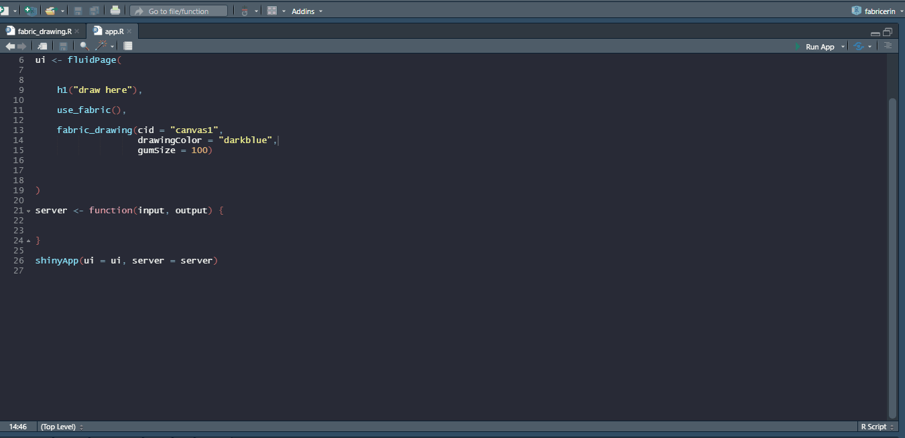
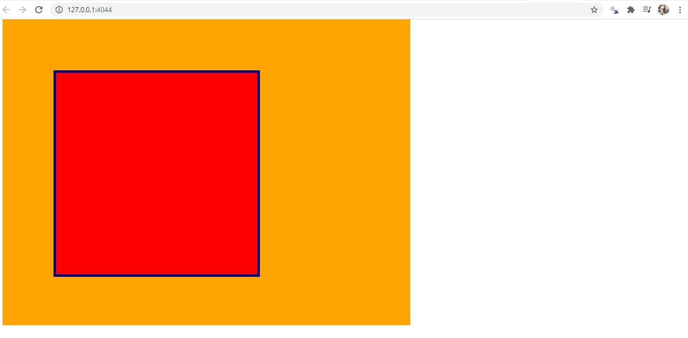
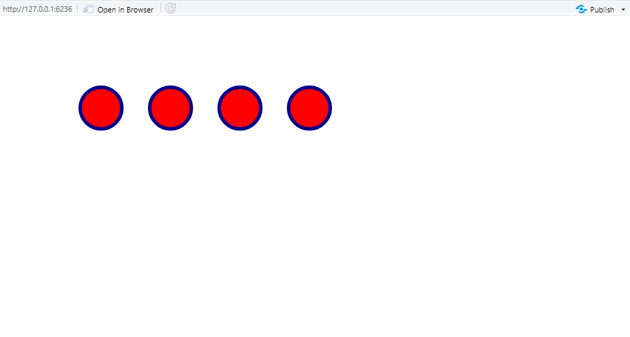
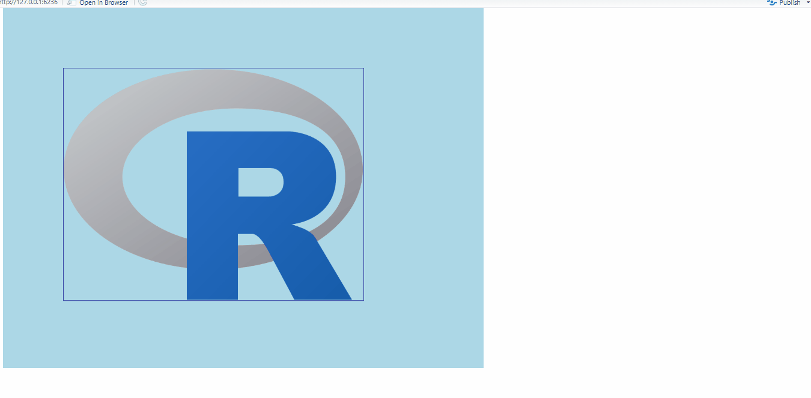
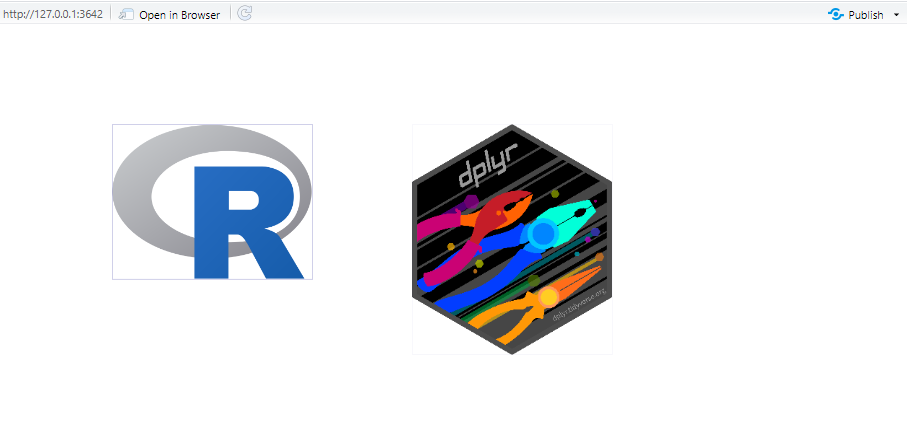
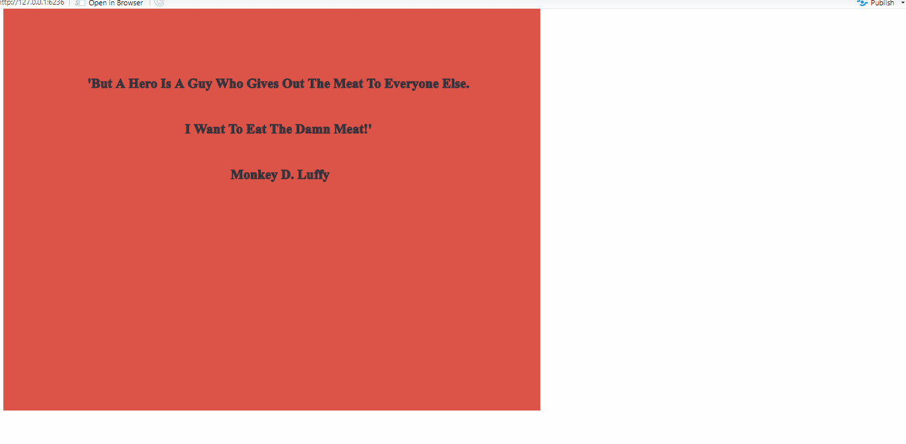
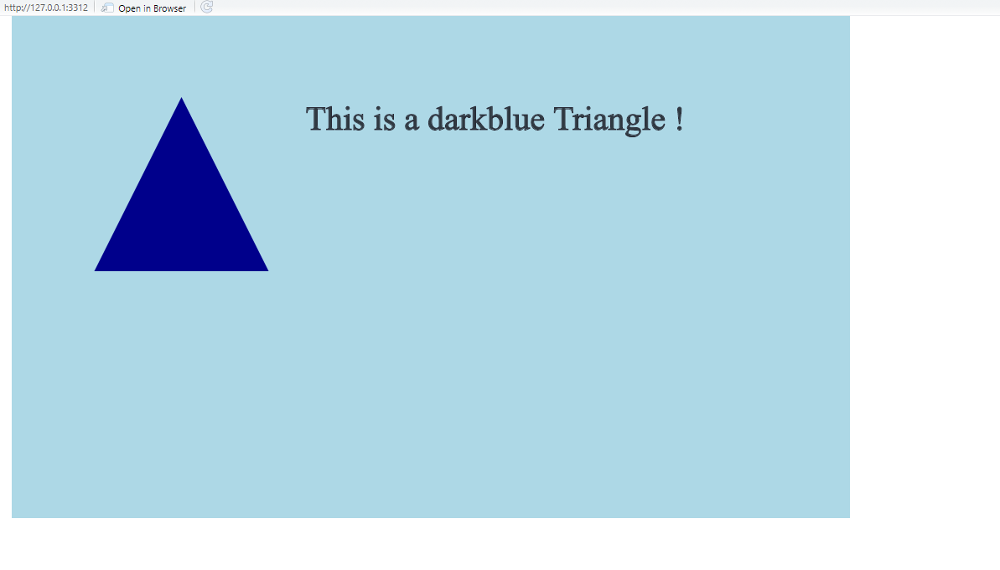
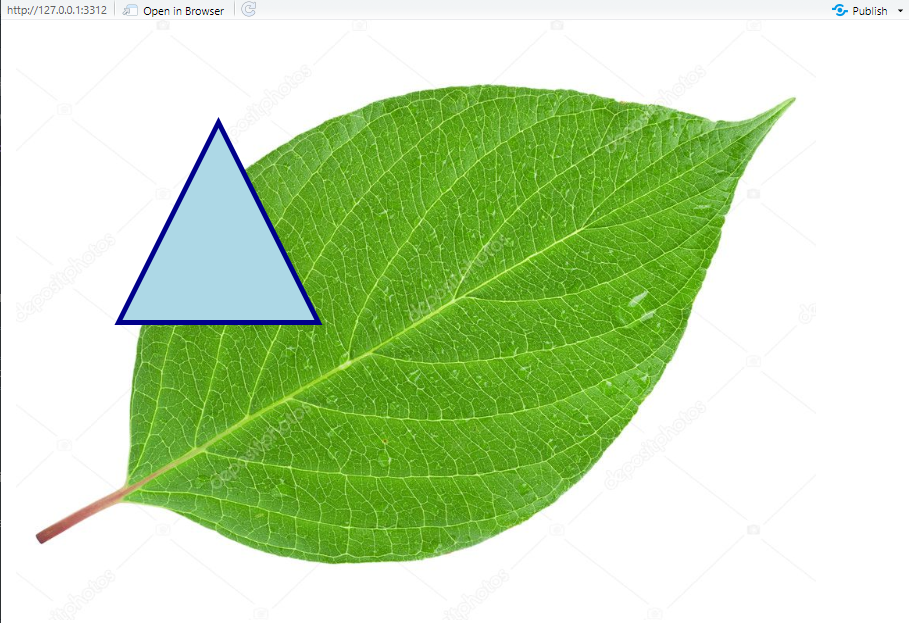

<!-- README.md is generated from README.Rmd. Please edit that file -->

```{r, include = FALSE}
knitr::opts_chunk$set(
  collapse = TRUE,
  comment = "#>",
  fig.path = "man/figures/README-",
  out.width = "100%"
)
```

# fabricerin

<!-- badges: start -->
<!-- badges: end -->

The `fabricerin` (spelled __fabrikerine__) package allows you to create easily canvas elements within your Shiny app and RMarkdown documents. You can use the canvas to render shapes, images and text. You can also create a canvas for drawing/taking notes purposes. Under the hoods, `fabricerin` relies on the the [fabricjs](http://fabricjs.com/) JavaScript library. 


## Installation


You can install the development version from [GitHub](https://github.com/) with:

```{r, eval=FALSE}
# install.packages("remotes")

remotes::install_github("feddelegrand7/fabricerin")

```


## Examples: 

First of all, I'd like to state that all the example provided apply the same way to Shiny and Rmd documents. Secondly, in order to use `fabricerin`, you always have to run the `use_fabric()` function at the beginning of your app/document. The function activates the [fabricjs](http://fabricjs.com/) library. Note that you'll need to be connected to the internet. Finally, `fabricerin` is not an R wrapper for the fabricjs library. The package doesn't cover all the capabilities of the library. The `fabricerin` package only relies on some specified features that according to me will help Shiny/Rmd users. Of course, if you need some improvement, feel free to create a Pull Request.  

### fabric_drawing(): Create a canvas for taking notes 
***

```{r, eval=FALSE}
library(shiny)
library(fabricerin)


ui <- fluidPage(
  
  
  use_fabric(), # do not forget to include the use_fabric() function at the beginning of your document
  
  h1("You can take some notes below"), 
  
  fabric_drawing(cid = "canvas1", 
                drawingColor = "darkblue", 
                gumSize = 50)
)

server <- function(input, output){}

shinyApp(ui, server)

```



## fabric_shape(): Render shape objects in canvas
***

Currently, `fabricerin` supports three types of shapes: Rectangle, Triangle, Circle and Polygon. The user can interact with the shape and modify its position, size and rotation. If you want to disable this interactivity, you can set `selectable =FALSE`


```{r, eval=FALSE}

library(shiny)
library(fabricerin)


ui <- fluidPage(
  
  
  use_fabric(), # do not forget to include the use_fabric() function at the beginning of your document
  
  fabric_shape(cid = "canvaId", # canvas id
               cfill = "orange", # canvas color
               cwidth = 800, # the width of the canvas
               cheight = 600, # the height of the canvas
               shapeId = "shapeId", # shape id
               shape = "Rect", 
               fill = "red", # shape color
               width = 400, 
               height = 400, 
               left = 100, # the position of the shape from the left relative to the canvas
               top = 100, # the position of the shape from the top relative to the canvas
               strokecolor = "darkblue", 
               strokewidth = 5, 
               selectable = TRUE)
  
)

server <- function(input, output){}

shinyApp(ui, server)


```





You can add as many shape as you want to an existing canvas using the `fabric_shape_add()` function. __Don't forget to reference the preexisting canvas with its ID:__

```{r, eval=FALSE}
library(shiny)
library(fabricerin)


ui <- fluidPage(
  
  
  use_fabric(), # do not forget to include the use_fabric() function at the beginning of your document
  
  fabric_shape(cid = "canvaId", 
               shapeId = "cr1", 
               shape = "Circle", 
               radius = 30, 
               left = 100), 
  
  fabric_shape_add(cid = "canvaId", 
                   shapeId = "cr2", 
                   shape = "Circle", 
                   radius = 30, 
                   left = 200),
  
  fabric_shape_add(cid = "canvaId", 
                   shapeId = "cr3", 
                   shape = "Circle", 
                   radius = 30, 
                   left = 300),
  
  fabric_shape_add(cid = "canvaId", 
                   shapeId = "cr4", 
                   shape = "Circle", 
                   radius = 30, 
                   left = 400)
  
)

server <- function(input, output){}

shinyApp(ui, server)
```




## fabric_image(): Render images in canvas
***

You can insert an image within a canvas a play with it using the `fabric_image()` function. Note that this function accepts only URL external images.


```{r, eval=FALSE}

ui <- fluidPage(

use_fabric(),

fabric_image(cid = "cimage",
              cfill = "lightblue",
              imgId = "Rimg",
              imgsrc = "https://upload.wikimedia.org/wikipedia/commons/thumb/1/1b/R_logo.svg/724px-R_logo.svg.png")

              )

server <- function(input, output) {}


shinyApp(ui = ui, server = server)


```




Similar to shapes, you can add images to preexisting canvas using the `fabric_image_add()` function: 


```{r,eval=FALSE}
library(shiny)
library(fabricerin)

ui <- fluidPage(

 use_fabric(),

 fabric_image(cid = "cimage",
              imgId = "Rimg",
              imgsrc = "https://upload.wikimedia.org/wikipedia/commons/thumb/1/1b/R_logo.svg/724px-R_logo.svg.png",
              imgheight = 200,
              imgwidth = 200),
 fabric_image_add(cid = "cimage",
                  imgId = "rstudioimg",
                  imgsrc = "https://raw.githubusercontent.com/rstudio/hex-stickers/master/PNG/dplyr.png",
                  imgwidth = 200,
                  imgheight = 200,
                  left = 400)
                  )

server <- function(input, output) {}

shinyApp(ui = ui, server = server)


```




## fabric_text(): Render text elements in canvas
***

The `fabric_text()` function has many arguments, feel free to check them out: 

```{r, eval=FALSE}

ui <- fluidPage(

use_fabric(),

fabric_text(cid = "cId",
          textId = "text",
          text = " 'But A Hero Is A Guy Who Gives Out The Meat To Everyone Else. \\n I Want To Eat The Damn Meat!' \\n Monkey D. Luffy",
          cfill = "#DD5347",
          left = 120,
          shadowCol = "blue",
          fontSize = 20,
          fontWeight = "bold",
          lineHeight = 3
          )
)
server <- function(input, output) {}

shinyApp(ui = ui, server = server)

```



Here also, we can use the `fabric_text_add()` function to incorporate a text object within a canvas element: 


```{r, eval=FALSE}

library(shiny)
library(fabricerin)


ui <- fluidPage(

use_fabric(),

fabric_shape(cid = "canvas123",
              cfill = "lightblue",
              cwidth = 1000,
              shapeId = "tri1",
              shape = "Triangle",
              fill = "darkblue"),

fabric_text_add(cid = "canvas123",
                 textId = "txt1",
                 text = "This is a darkblue Triangle !",
                 left = 350
                 )

                 )

server <- function(input, output) {}

shinyApp(ui = ui, server = server)


```




## fabric_curtail(): Add a background or an overlay image to a canvas


You can set an image as a background or as a foreground (overlay) for a canvas as follows: 

```{r, eval=FALSE}

ui <- fluidPage(

 use_fabric(),

 fabric_shape(cid = "canvas123",
              shapeId = "tri1",
              shape = "Triangle",
              fill = "lightblue"),

fabric_curtail(cid = "canvas123",
              imgsrc = "https://st.depositphotos.com/1642482/1904/i/950/depositphotos_19049237-stock-photo-leaf.jpg",
              type = "background"

              )

)

server <- function(input, output) {}


shinyApp(ui = ui, server = server)


```
 



## Code of Conduct

Please note that the fabricerin project is released with a [Contributor Code of Conduct](https://contributor-covenant.org/version/2/0/CODE_OF_CONDUCT.html). By contributing to this project, you agree to abide by its terms.
